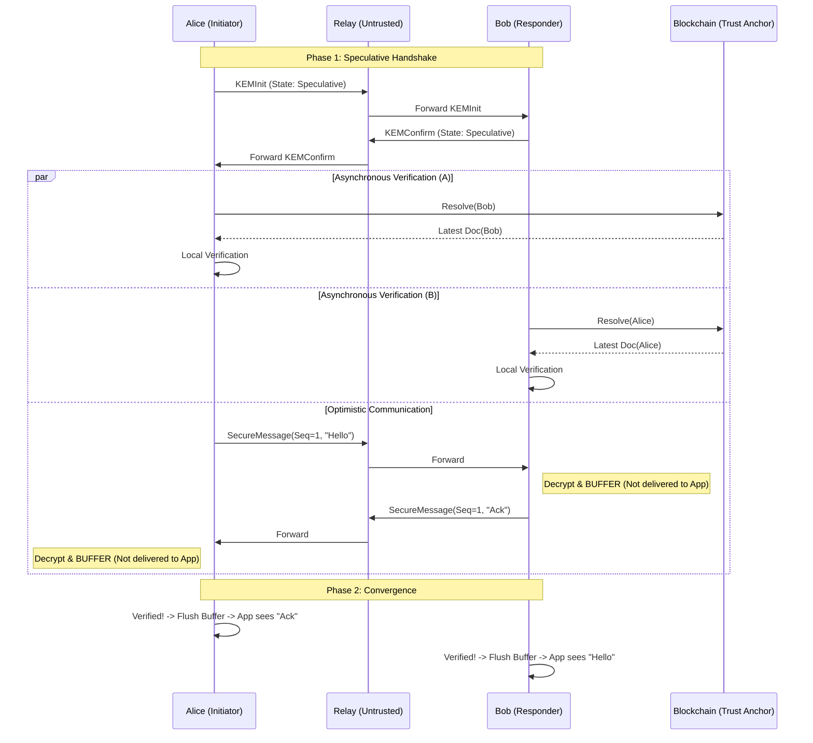

# Atrium Specification

> **版本:** 1.0.0 (Minimalist AKE Core)
> **状态:** 协议草案 (Draft Standard)
> **传输层:** TCP (Length-Prefixed) + Protobuf
> **安全模型:** 后量子、零信任中继、自主验证 (Self-Sovereign Verification)

---

## 1. 摘要 (Executive Summary)

Atrium 是一种去中心化的认证密钥交换 (AKE) 协议。其核心创新在于解决了去中心化身份 (DID) 网络中的 **“安全-延迟悖论”**。通过引入 **推测式执行 (Speculative Execution)** 和 **异步身份验证 (Asynchronous Verification)**，Atrium 实现了 0-RTT 的会话启动速度，同时保证了强一致性的后量子安全底线。

---

## 2. 协议状态机 (Protocol State Machine)

Atrium 的安全性建立在严格的状态机逻辑之上。状态机不仅控制信令交互，更作为 **“应用层数据隔离闸门 (Data Isolation Gate, DIG)”** 控制明文消息的交付。

### 2.1 会话状态定义 (Session States)

| 状态 (State) | 符号 | 描述 | 数据处理策略 |
| :--- | :--- | :--- | :--- |
| **初始态 (IDLE)** | $S_{idle}$ | 会话尚未建立。 | 不允许收发。 |
| **推测态 (SPECULATIVE)** | $S_{spec}$ | 握手基于本地缓存完成，异步查链中。 | **允许发送**；**隔离接收**（解密但不交付应用层）。 |
| **确权态 (VERIFIED)** | $S_{ver}$ | 后台查链完成，身份已获账本真值验证。 | **全双工交付**（开放闸门，推送隔离缓冲区消息）。 |
| **中止态 (ABORTED)** | $S_{abort}$ | 验证失败或协议违规，会话永久失效。 | **物理熔断**（销毁密钥，清空隔离缓冲区，关闭连接）。 |

### 2.2 状态转换逻辑 (State Transitions)

1.  **$S_{idle} \to S_{spec}$ (乐观转换)**: 
    *   **触发条件**: 命中本地 DID 缓存并成功发出 `KEMInit` (发起方) 或成功解密 `KEMInit` (响应方)。
    *   **动作**: 初始化密钥链，启动后台异步验证线程。
2.  **$S_{idle} \to S_{ver}$ (保守转换)**:
    *   **触发条件**: 缓存未命中，完成阻塞式链上查询后建立会话。
3.  **$S_{spec} \to S_{ver}$ (确权升级)**:
    *   **触发条件**: 接收并验证通过来自共识层的真实性证明 (Proof of Authenticity)，包括但不限于 SPV 证明、聚合签名 QC 或 ZK 证明。
    *   **原子动作 (Normative)**: 实现必须保证 **原子性**。在转换状态前，必须先按序 (`Sequence Number`) 推送隔离缓冲区所有消息至应用层，随后立即切换至 $S_{ver}$ 模式以处理后续实时消息。
4.  **$S_{spec} \to S_{abort}$ (安全熔断)**:
    *   **触发条件**: 后台验证返回 `Mismatch` 或收到对端的 `ERROR_VERIFICATION_FAILED` 状态包。
    *   **动作**: 立即销毁内存密钥，清空隔离缓冲区，物理断开 TCP 连接。

---

## 3. 核心机制 (Core Mechanisms)

### 3.1 自主验证与证据驱动原则 (Autonomous & Evidence-Driven Verification)

协议规定：通信双方**不依赖**对端提供的版本声明，必须独立通过获取共识层证据 (Consensus Evidence) 验证对端的身份。

*   **发起方 (A)**：使用其认为“最新”的 B 公钥发起握手。
*   **响应方 (B)**：使用其认为“最新”的 A 公钥验证请求并响应。
*   **证据校验**：双方各自启动异步过程，获取包含 Merkle 路径或聚合签名的真实性证明。
*   **最终一致性确认**：在 $T_{chain}$ 时间窗口内完成证据校验，从而保障最终应用层认证完整性 (Eventual Application-Layer Authenticity, EALA)。

### 3.2 数据隔离策略 (Data Isolation Policy)

处于 $S_{spec}$ 状态时，协议栈必须维持一个 **隔离缓冲区 (Isolation Buffer)**。

*   **入站处理 (Normative)**: 收到 `SecureMessage` 后，Ratchet 演化密钥并执行 AES-GCM 解密，但解密后的明文**严禁 (MUST NOT)** 交付给应用层回调。

### 3.3 主动错误传播 (Proactive Error Propagation)

为了缩短全网的安全风险窗口，协议引入了主动告警机制：
*   一旦任一端在异步验证中检测到失败，在物理断开前，**应当 (SHOULD)** 尝试发送一个 `Packet_Status` (Code: `ERROR_VERIFICATION_FAILED`) 给对端。
*   对端接收到此特定状态包后，必须立即同步进入 $S_{abort}$ 逻辑，即使其自身的异步验证尚未完成。

---

## 4. 协议流程 (Protocol Flow)

---

## 5. 实现建议与注意事项 (Implementation Considerations)

本章节不属于核心协议约束，仅作为工程实现的指导建议。

### 5.1 内存水位线 (Memory High-Water Mark)
由于 $S_{spec}$ 状态下的消息被存储在隔离缓冲区中，实现应当设置合理的 **内存水位线**（如 100 条消息或一定容量）。若在背景验证完成前缓冲区溢出，建议实现主动触发 $S_{abort}$ 以防止内存耗尽攻击 (DoS)。

### 5.2 查链频率控制 (Resolution Throttling)
为了减轻区块链基础设施的压力，实现应当对同一 DID 的解析请求频率进行限制，并配合本地缓存 TTL 使用。

---

## 6. 基础设施扩展 (Optional Extensions)

*   **DID 解析代理**: 定义 `DIDDocumentRequest/Response` 允许通过中继进行代理查询，但客户端必须在收到响应后自行验证文档签名。
*   **PQC 证书扩展**: 支持将 Dilithium 等签名算法集成至 DID Document 证明中。

# Atrium 协议：形式化安全模型与推测执行证明 (Formal Security Model & Speculative Execution Proof)

> 本文档基于扩展的 Bellare-Rogaway (eBR) AKE 安全模型，引入了推测状态约束 (Speculative State Constraints) 和棘轮演化博弈 (Ratchet Security Game)，通过博弈序列法 (Game-Hopping) 对 Atrium 协议进行数学归约证明。

---

## 1. 扩展 eBR 安全模型定义 (Extended eBR Security Model)

### 1.1 协议实例与会话标识 (Protocol Instances & Session Identifiers)
设 $\mathcal{P}$ 为协议参与者集合。每个参与者 $i$ 可以并发执行多个协议实例，记为 $\Pi(i, s)$，其中 $s$ 为本地会话索引。

**会话标识符 (Session ID, $sid$)**:
一个唯一的字符串，用于绑定一次特定的密钥交换执行。定义为交互报文的哈希：
$$ sid = \text{Hash}(N_{init} \parallel N_{confirm} \parallel pk_i \parallel pk_j \parallel ct) $$

**匹配会话 (Matching Sessions / Partner Function)**:
若实例 $\Pi(i, s)$ 与 $\Pi(j, t)$ 满足以下条件，则称它们互为伙伴 (Partners)：
1. 二者计算出的 $sid$ 完全一致。
2. $\Pi(i, s)$ 认定的对端是 $j$，$\Pi(j, t)$ 认定的对端是 $i$。
3. 二者均生成了接受状态 (Accepted State)，派生出相同的根会话密钥 $SK$。

### 1.2 敌手预言机查询 (Adversary Oracle Queries)
敌手 $\mathcal{A}$ 是一多项式时间 (PPT) 算法，可通过以下预言机与系统交互：

*   **$\text{Send}(i, s, M)$**: 向实例 $\Pi(i, s)$ 发送消息 $M$ 并获取其响应。这模拟了 $\mathcal{A}$ 对网络的完全控制。
*   **$\text{Corrupt}(i)$**: 泄露参与者 $i$ 的长期签名私钥 (Ed25519)。
*   **$\text{Reveal}(i, s)$**: 泄露实例 $\Pi(i, s)$ 派生出的当前会话密钥 $SK$。模拟会话级别的短暂泄露。
*   **$\text{ResolveDelay}(DID, \Delta t)$**: 专门针对身份解析预言机 $\mathcal{O}_{resolve}$ 的网络操纵。允许 $\mathcal{A}$ 拦截并延迟针对特定 DID 的身份真实性证明的投递，从而人为延长推测窗口。
*   **$\text{Test}(i, s)$**: 安全博弈的核心查询（仅限调用一次）。
    *   条件：$\Pi(i, s)$ 必须是 **新鲜的 (Fresh)**（即未被 Corrupt 或 Reveal 直接攻破）。
    *   操作：挑战者 $\mathcal{C}$ 抛一枚公平硬币 $b \in \{0,1\}$。若 $b=0$，返回真实的 $SK$；若 $b=1$，返回与 $SK$ 同等长度的随机均匀字符串。$\mathcal{A}$ 需要输出猜测 $b'$。

---

## 2. 安全目标定义 (Security Definitions)

### 2.1 语义安全与机密性 (Semantic Security / Key Indistinguishability)
定义协议满足语义安全，若对于任意 PPT 敌手 $\mathcal{A}$，其在 Test 查询中猜测正确的优势是可忽略的：
$$ \text{Adv}_{\mathcal{A}}^{IND} = \left| \Pr[\mathcal{A} \text{ outputs } b' = b] - \frac{1}{2} \right| \le \epsilon_{crypto} $$

### 2.2 最终应用层认证完整性 (EALA)
EALA 是 Atrium 协议对传统 AKE 认证目标的重大范式转移。我们将安全目标从“阻止非法信道的建立 (Channel Authenticity)”转变为“阻止非法信道数据的交付 (Delivery Authenticity)”。

**定义 1 (EALA 安全性)**：若对于任意 PPT 敌手 $\mathcal{A}$，其赢得以下博弈的优势是受限的：
1. $\mathcal{A}$ 利用 $\text{Send}(i, s, C_{fake})$ 向进入 $S_{spec}$ 状态的 $\Pi(i, s)$ 注入伪造密文。
2. $\mathcal{A}$ 获胜条件：节点 $i$ 执行了 $\text{Deliver}(P^*)$，且 $P^*$ 解密自 $C_{fake}$，且该消息未记录在真实 $j$ 的发送日志中。

为了支撑 EALA 证明，我们必须形式化定义**数据隔离闸门 (DIG) 的状态转换系统 (Formal Transition System)**。定义状态演化函数 $\delta: \mathbb{S} \times Event \to \mathbb{S} \times Action$：

*   $\delta(S_{idle}, \text{Cache\_Hit}) \to (S_{spec}, \text{Init\_Keys})$
*   $\delta(S_{spec}, \text{Recv\_Msg}) \to (S_{spec}, \text{Buffer.Push(Msg)})$  *(核心：拦截交付)*
*   $\delta(S_{spec}, \text{Proof\_Valid}) \to (S_{ver}, \text{DeliverAll(Buffer)})$ *(原子性释放)*
*   $\delta(S_{spec}, \text{Proof\_Invalid}) \to (S_{abort}, \text{Clear(Buffer)})$ *(原子性熔断)*

---

## 3. Q-Ratchet 的形式化安全模型 (Ratchet Security Game)

Q-Ratchet 是 Atrium 的状态演化机制。设内部状态为 $St_i$，消息密钥为 $MK_i$。
演化函数：$ (St_{i+1}, MK_i) \leftarrow \text{Ratchet}(St_i) $

为了刻画 Q-Ratchet 的混合设计，我们引入附加的预言机：
*   **$\text{StateReveal}(i, s, t)$**: 泄露实例 $\Pi(i, s)$ 在第 $t$ 步棘轮时的内部状态 $St_t$。

### 3.1 前向安全 (Forward Secrecy, PFS)
**定义**: 若 $\mathcal{A}$ 调用 $\text{StateReveal}(i, s, t)$ 获取了 $St_t$，她仍无法在 $\text{Test}(i, s, t')$ (其中 $t' < t$) 中取得不可忽略的优势。
*   **证明支撑**: 基于对称 Hash 函数（如 HMAC-SHA256）的单向性与抗原像攻击特性。

### 3.2 基于动态阈值的后向安全 (Post-Compromise Security, PCS)
纯哈希棘轮不具备 PCS。Atrium 引入 **基于概率熵衰减的 Epoch-KEM 注入 (Adaptive Ratchet Rotation)**。
*   **定量风险模型 (Mathematical Risk Model)**: 设距离上次 KEM 注入已过去时间 $\Delta t_{kem}$，期间发送了 $n$ 条消息。我们定义基于时间的侧信道泄露系数为 $\lambda_t$，基于数据量的统计学分析系数为 $\lambda_n$。状态被敌手提取的累计风险函数定义为指数衰减模型：
    $$ Risk(\Delta t_{kem}, n) = 1 - \exp(-(\lambda_t \cdot \Delta t_{kem} + \lambda_n \cdot n)) $$
*   **轮换策略 (Rotation Policy)**: 定义安全上限阈值 $\Theta_{risk}$。当 $Risk(\Delta t_{kem}, n) > \Theta_{risk}$ 时，协议强制执行一次全新的 Kyber768 KEM 握手，将新的共享秘密混入当前 $St$，清零 $\Delta t_{kem}$ 与 $n$。
*   **定义 (Epoch-PCS)**: 若 $\mathcal{A}$ 调用 $\text{StateReveal}(i, s, t_{leak})$ 获取了状态，但在 $t_{recover}$ 时刻协议执行了基于上述风险模型的 Epoch-KEM 轮换，则对于任意 $t' > t_{recover}$，$\mathcal{A}$ 在 $\text{Test}(i, s, t')$ 中的优势再次降为可忽略。

---

## 4. 安全性归约证明概要 (Proof Sketch via Game-Hopping)

定理 1: 假设 Ed25519 满足 EUF-CMA，Kyber768 满足 IND-CCA2，且底层共识协议提供最终确定性 $F(k)$，则 Atrium 满足 EALA 认证性及 IND-CCA2 机密性。

### Game 0 (真实博弈)
$\mathcal{A}$ 攻击真实协议。

### Game 1 (剥夺伪造能力)
修改挑战者：若 $\mathcal{A}$ 提交了未经诚实方生成的合法签名，触发 Abort。基于 EUF-CMA 假设，差值为 $\epsilon_{sig}$。
*   此时，我们保证了匹配会话 (Matching Sessions) 的前提：只要验证通过，通信方必定是预期的 Owner。

### Game 2 (剥夺密文区分能力)
在 Test 查询中，将 Kyber 真实输出替换为理想随机数。基于 IND-CCA2 假设，差值为 $\epsilon_{kem}$。
*   此时，证明了协议的基础 Semantic Security。

### Game 3 (证明携带与推测隔离)
处理 EALA 违规。$\mathcal{A}$ 唯一的路径是提供非法的有效性证明（如过期的 SPV/QC）。
由于 DIG 机制限制 `Deliver` 仅在状态跳转为 VERIFIED 后执行，$\mathcal{A}$ 成功的概率被严格约束于共识系统的故障率：
$$ \Pr[\text{EALA violation}] \le P_{reorg}(k) + \epsilon_{consensus} $$

### 结论
Atrium 协议在满足标准 AKE 的 IND-CCA2 与 PFS 属性的同时，通过 DIG 与参数化验证机制，将异步网络的延迟漏洞归约为了底层共识的鲁棒性问题。

# Atrium 协议：理论框架与核心能力 (Theoretical Framework & Core Capabilities)

> **学术发表的形式化安全模型 (Formal Security Model)**
> 本文档概述了 Atrium 协议的理论贡献。通过引入“证明携带型解析 (Proof-Carrying Resolution)”与“数据隔离闸门 (DIG)”，协议实现了在异步不确定网络环境下的最终应用层认证完整性 (EALA)。

---

## 1. 理论贡献 A：S-AKE (推测式认证密钥交换)

### 1.1 问题定义：安全-时延悖论 (Security-Latency Paradox)
在去中心化身份 (DID) 网络中，身份验证依赖于分布式账本的共识确认。
*   **Safety (安全性)**：要求等待账本终局性确认 (Consensus Finality)，以排除公钥撤销风险。
*   **Liveness (活性)**：要求即时响应 (0-RTT)，提供无缝的用户体验。

传统协议将验证视为建立连接的前置条件。Atrium 提出将身份验证解耦为“证明携带型”的异步过程。

### 1.2 核心机制：推测状态与数据隔离闸门 (Speculative State & DIG)

**定义 (推测状态 $\hat{s}$)**：协议在完成加密握手后，尚未获得共识证明的中间状态。该状态允许全双工的密文传输与 Ratchet 状态同步，但通过 **数据隔离闸门 (Data Isolation Gate, DIG)** 物理阻断明文向应用层的交付。

**协议固有规则 (Normative Rules):**
1.  **证据驱动验证 (Evidence-Driven)**：节点不依赖对端声明，必须获取来自共识层的真实性证明 (Proof of Authenticity)，如 SPV 证明、聚合签名 QC 或 ZK 证明。
2.  **强制性隔离 (Mandatory Isolation)**：在 $S_{spec}$ 状态下，所有解密后的明文必须留存在隔离缓冲区 (Isolation Buffer) 中。
3.  **原子性收敛 (Atomic Convergence)**：一旦本地验证器 (Verifier) 确认证明合法，系统必须原子性地执行：[状态升级] $\to$ [缓冲区按序推送] $\to$ [开启实时交付]。

### 1.3 形式化一致性概率模型 (Formal Consistency Model)

#### 1.3.1 推测状态的形式化定义
设 $\mathbb{S}$ 为所有已获得共识终局性确认的状态集。一个推测状态 $\hat{s} \in \hat{\mathbb{S}}$ 满足：
1.  **非终局性**: $\hat{s} \notin \mathbb{S}$。
2.  **缓存依赖性**: $\hat{s}$ 依赖本地缓存 $\mathcal{C}$，假设 $\mathcal{C} \cong \mathcal{L}$ ($\mathcal{L}$ 为当前账本真实状态)。
3.  **冲突回滚**: 若检测到 $\mathcal{C} \neq \mathcal{L}$，推测状态 $\hat{s}$ 被立即丢弃，会话转换至终止态 $S_{abort}$。

#### 1.3.2 概率一致性界限 (Probabilistic Consistency Bounds)
我们引入一致性概率函数 $P(\Delta t)$ 来刻画风险窗口：
$$ P(\Delta t) = \Pr[ \text{攻击者在 } \Delta t \text{ 时间内利用过期凭证成功欺骗应用层} \mid \text{会话处于 } S_{spec} ] $$

由于 DIG 机制的存在：
*   **定理**: 若 $t < T_{chain}$ (验证证明到达时间)，虽然加密信道可能被敌手建立，但由于明文未 `Deliver`，敌手无法诱导用户执行具有副作用的操作。
*   **结论**: 系统的应用层风险 $P(\Delta t)$ 仅取决于“共识证明被伪造”或“极短时间内的链重组”概率，趋近于密码学意义上的可忽略极小值 $\epsilon$。

---

## 2. 理论贡献 B：Q-Ratchet (轻量级后量子前向安全)

### 2.1 混合熵注入 (Hybrid Entropy-Injection)
针对 Kyber 等后量子算法密文尺寸大的特性，Atrium 采用混合演化模型：
1.  **数据包级 (Packet-Level)**: 使用对称哈希链 (HKDF chain) 实现 $O(1)$ 计算开销的前向安全 (PFS)。
2.  **周期级 (Epoch-Level)**: 周期性 $N$ 注入 KEM 握手，引入新鲜量子熵，实现后向安全性 (PCS)。

### 2.2 基于概率熵衰减的自适应轮换模型 (Adaptive Ratchet Rotation via Entropy Decay)

纯哈希棘轮虽具有前向安全性，但在状态被提取 (State Compromise) 后无法实现后向安全自愈。为此，我们引入一种可量化的**熵衰减模型 (Entropy Decay Model)** 来驱动 Epoch-KEM 的自适应注入。

**定量风险模型 (Mathematical Risk Model)**：
假设协议状态由于内存扫描或侧信道攻击导致的泄露服从泊松分布。设当前距离上一次 KEM 注入已过去时间 $\Delta t_{kem}$，且在此期间系统处理了 $n$ 条加密消息。
我们定义**时间驱动的泄露系数** $\lambda_t$ 与 **事件驱动（侧信道）的泄露系数** $\lambda_n$。系统状态被未知敌手提取的累积风险函数定义为：
$$ Risk(\Delta t_{kem}, n) = 1 - \exp(-(\lambda_t \cdot \Delta t_{kem} + \lambda_n \cdot n)) $$

**线性安全预算与自适应触发 (Linear Security Budget & Trigger)**：
协议设定一个安全容忍上限阈值 $\Theta_{risk}$。当 $Risk > \Theta_{risk}$ 时，必须强制执行 Epoch-KEM 轮换以注入新鲜量子熵。
为适配资源受限设备，我们对触发不等式两边取对数进行线性化推导：
$$ 1 - \exp(-(\lambda_t \cdot \Delta t_{kem} + \lambda_n \cdot n)) > \Theta_{risk} $$
$$ \lambda_t \cdot \Delta t_{kem} + \lambda_n \cdot n > -\ln(1 - \Theta_{risk}) $$
令常数安全预算 $C = -\ln(1 - \Theta_{risk})$，协议状态机只需维护一个简单的线性积分器：
$$ \text{Accumulated\_Leakage} = \lambda_t \cdot \Delta t_{kem} + \lambda_n \cdot n $$
当 $\text{Accumulated\_Leakage} > C$ 时，协议自动触发新一轮的 Kyber768 握手，重置 $\Delta t_{kem}$ 与 $n$。

此模型在不改变底层密码学算法的前提下，通过系统级的调度策略，实现了后向量子安全 (PCS) 与带宽开销的数学最优解。

---

## 3. 核心能力总结

| 能力 | 工程视角 (实现) | 科学视角 (协议理论) |
| :--- | :--- | :--- |
| **0-RTT 启动** | 基于本地缓存的乐观执行 | **S-AKE**: 针对高延迟信任锚点的推测执行模型。 |
| **隔离防御** | 应用层数据隔离与拦截 | **Data Isolation Gate**: 推测窗口内的交付阻断策略。 |
| **确权升级** | 轻客户端证明 (SPV/QC) 校验 | **Proof-Carrying Resolution**: 基于共识证据的状态机确权转换。 |
| **PFS (前向安全)**| 基于对称哈希的密钥滚动 | **Q-Ratchet**: 面向受限环境的、混合熵注入的密钥演化函数。 |
